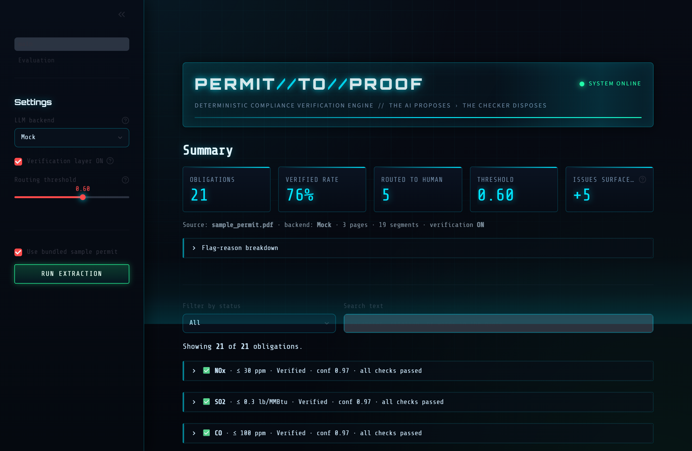
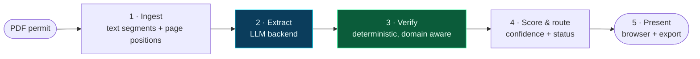
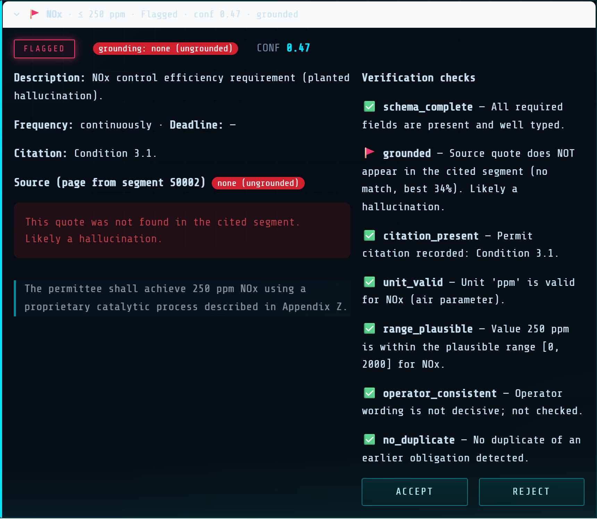
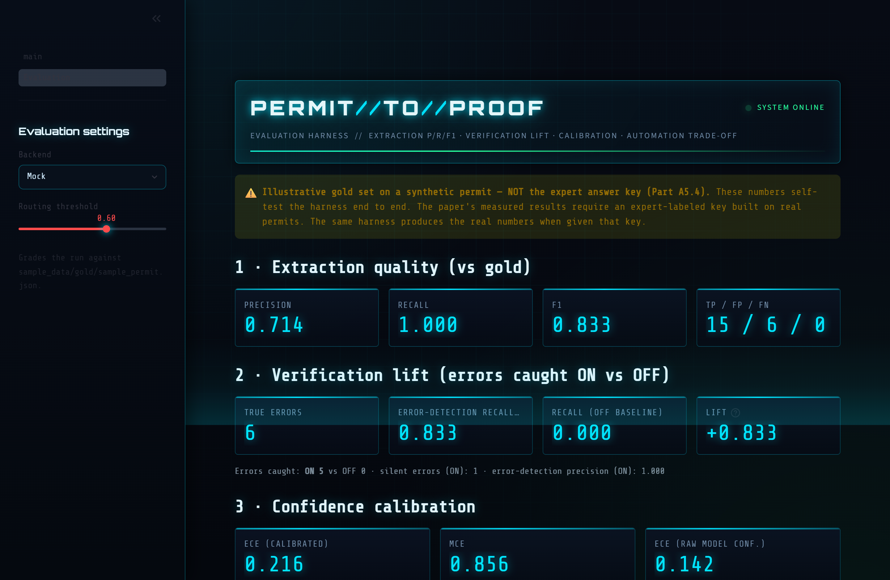

<div align="center">

# ⬡ Permit-to-Proof

### A verifiable LLM system for environmental permit compliance

**The AI proposes. A deterministic checker disposes.**

An LLM reads an environmental permit and extracts every compliance obligation. A separate, deterministic, domain aware layer then verifies each one against the source text before it is trusted. No obligation is ever marked Verified on the model's say so alone.


<br/>



<sub>The command console: extract, verify, and route every obligation, with live metrics and the error detection lift.</sub>

</div>

---

## ⚡ Why this exists

Factories and plants operate under environmental permits: long legal documents that set how much of each pollutant they may release, how often to measure, and when to report. A single permit can hold hundreds of obligations, and reading them by hand is slow and error prone.

An LLM can extract those obligations automatically, but models sometimes **invent text**, and in compliance a fabricated or missed obligation is a real liability. So the model cannot be trusted on its own word. Permit-to-Proof keeps the speed of the LLM and adds the one thing it lacks: **proof**.

> **The rule that is never broken:** the LLM proposes obligations; a separate, deterministic layer verifies every one against the permit text and confirms the exact supporting quote really exists. What passes is **Verified**. What fails is **Flagged** or routed to a human.

---

## 🔭 How it works



Five stages, kept separate so each can be tested alone. **Stage 3, the verification layer, never calls the model and never touches the internet.** That separation is the entire scientific point.

---

## 🛡️ The anti hallucination core

If the model returns a quote that does not actually appear in the cited permit segment, the obligation fails grounding and is flagged, no matter how confident the model sounded. The grounding check is hardened against fabricated values (digits **and** spelled out numbers), unit swaps, negation flips, and quotes spliced from distant text, while still tolerating harmless formatting drift.

<div align="center">


<sub>A planted hallucination caught in the act: the quote is not in the source, so grounding fails and the obligation is flagged with the reason, the page, and every check shown.</sub>
</div>

### The seven checks

| Check | Confirms | On fail |
|---|---|---|
| `schema_complete` | Required fields present and well typed (a numeric limit has value, unit, operator) | error → Flagged |
| `grounded` | The quote actually appears in the cited segment; records match type exact / fuzzy / none | error → Flagged |
| `citation_present` | A permit section or regulatory reference is recorded | warning |
| `unit_valid` | The unit fits the parameter (air versus water) — a domain check | warning |
| `range_plausible` | The value sits in a sensible envelope for the parameter — a domain check | warning |
| `operator_consistent` | The operator matches the wording ("shall not exceed" implies a maximum) — a domain check | warning |
| `no_duplicate` | Not a repeat of an obligation already extracted | info |

The three domain checks encode environmental compliance semantics (16 regulated parameters across Title V air and NPDES water programs) that general purpose verifiers do not have.

---

## ✨ Features

- 🧠 **Switchable backends** — Mock (offline default), OpenAI, and Ollama behind one interface.
- 🔌 **Runs offline, no API key** — the bundled synthetic permit runs end to end on a clean machine.
- 🎚️ **Tunable automation** — a routing threshold slider trades automation against human review, live.
- 🧪 **Verification ON / OFF switch** — the headline experiment: errors caught with the layer on versus off.
- 📊 **Built in evaluation harness** — precision, recall, F1, error detection lift, calibration (ECE), and a selective prediction trade off curve, with figures.
- 👤 **Human in the loop** — accept or reject any obligation; overrides persist for the session.
- 📤 **Real exports** — download everything as JSON and CSV, including statuses, checks, and match types.
- 🎛️ **Command console UI** — a dark heads up display with live status, animated metrics, and pulsing alerts.

---

## 🚀 Quickstart

You only need Python 3 (3.10 to 3.13 recommended).

| Platform | Command |
|---|---|
| **Windows** | double click `run.bat` |
| **macOS / Linux** | `./run.sh` |

It creates a virtual environment, installs the pinned dependencies, and opens the app at `http://localhost:8501`. The bundled sample runs instantly, fully offline, with **no API key**.

<details>
<summary>Manual setup</summary>

```bash
python -m venv .venv
# Windows:  .venv\Scripts\activate
# mac/Linux: source .venv/bin/activate
pip install -r requirements.txt
streamlit run app/main.py
```
</details>

---

## 📐 Evaluation: it measures itself

Permit-to-Proof does not just run the workflow, it **measures** it. The harness grades extraction against a gold answer key and produces the four numbers a methods paper needs.

<div align="center">


<sub>Extraction quality, verification lift, calibration, and the automation trade off, graded against a gold key, with the provenance of the key shown on every panel.</sub>
</div>

```bash
python evaluate.py --out eval_out      # writes metrics.json, a report, and four figures
```

> ⚠️ **Honesty note.** The numbers shown above (F1 0.83, lift +0.83, ECE 0.22) are the **synthetic self test** on the bundled fake permit, labeled `ILLUSTRATIVE_AUTHOR_KNOWN`. They demonstrate that the harness works; they are **not** measured results. Real results require an expert labeled gold key on real permits. The repository ships the [labeling toolkit](annotation/PROTOCOL.md) (template, protocol, converter, and an inter annotator agreement tool) that turns that hand labeling into the key, after which the same harness fills the tables with measured values.

---

## 🧱 Architecture

```
app/
├─ core/          schema · ingest · verify · score · pipeline   (no model calls in verify)
├─ llm/           base · mock · openai_backend · ollama_backend
├─ eval/          gold · metrics · report · annotate · agreement
├─ pages/         the interactive Evaluation page
├─ ui_theme.py    the heads up display theme
└─ main.py        the Streamlit app (presentation only)
evaluate.py       evaluation harness CLI
sample_data/      synthetic permit + illustrative gold set
docs/             methodology + domain knowledge provenance
tests/            106 tests, offline
```

---

## 📚 Documentation

- **[docs/methodology.md](docs/methodology.md)** — evaluation protocol, metric definitions, threats to validity, Data and Code Availability.
- **[docs/domain_knowledge.md](docs/domain_knowledge.md)** — provenance of the unit and range checks (Title V, NSPS, NPDES program structure).
- **[annotation/PROTOCOL.md](annotation/PROTOCOL.md)** — how a domain expert builds the gold answer key.

---

## 🧪 Tests

```bash
pytest        # 106 passing, offline, in a few seconds
```

The verification layer is covered most heavily, including adversarial grounding cases (fabricated values, spelled out numbers, unit swaps, negation flips) that must **not** pass as fuzzy matches. The OpenAI and Ollama live calls are opt in (`PTP_RUN_LIVE_BACKENDS=1`), so a stray local model server can never pull the default suite onto the network.

---

## 🧰 Tech stack

`Python` · `Streamlit` · `Pydantic v2` · `pdfplumber` · `matplotlib` · `OpenAI` · `Ollama` · `pytest`

---

## 📖 Citation & license

Released under the **MIT License** (see [LICENSE](LICENSE)). If you use Permit-to-Proof in academic work, please cite it via [CITATION.cff](CITATION.cff).

<div align="center">
<sub>Built as the working artifact behind a methods paper on verification reliability for LLM based compliance extraction.<br/>The bundled permit is fictional and contains no real regulatory data.</sub>
</div>
